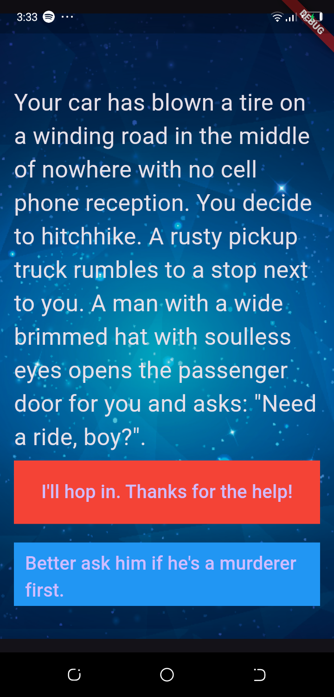
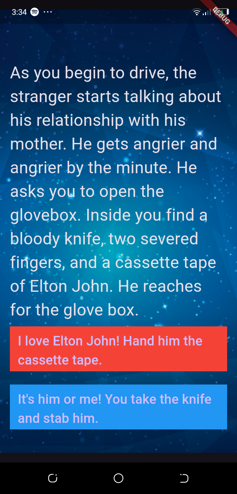
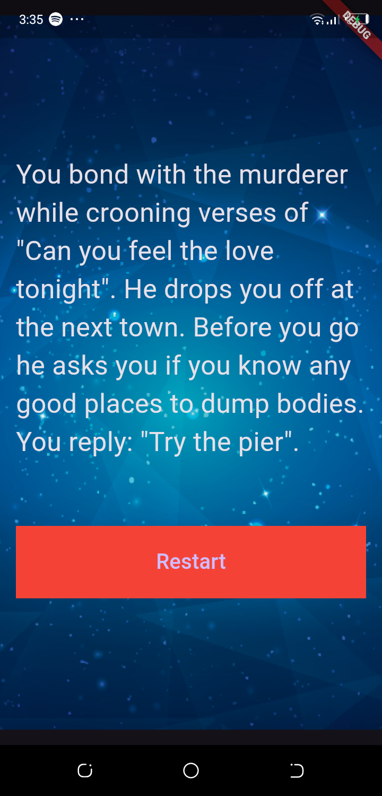

# Destini App

## Overview

The Destini app is a Flutter-based interactive storytelling app where users make choices that affect the outcome of the story. It presents the user with various scenarios and choices, leading to different outcomes based on their decisions.

## Project Structure

The project is structured into several Dart files:

- `main.dart`: The entry point of the Flutter app, setting up the `MaterialApp` and `StoryPage` widget.
- `story_brain.dart`: Contains the `StoryBrain` class that manages the story data and logic for navigating through different story paths.
- `story.dart`: Defines the `Story` class, which represents individual story segments.

## Files

### `main.dart`

This file is the main entry point of the app and contains the `Destini` class, which sets up the app's theme and home page. The `StoryPage` widget is used to display the story and choices to the user.

### `story_brain.dart`

This file defines the `StoryBrain` class, which holds a list of `Story` objects and provides methods to navigate through the stories based on user choices.

### `story.dart`

This file defines the `Story` class, representing each story segment with a title and two choices. It uses named parameters to initialize its fields.

## How to Run the App

1. **Clone the Repository:**
   ```bash
   git clone <repository-url>
    ``
2. **Navigate to the Project Directory:**
    ```bash
    cd <project-directory>
   ``
3. **Install Dependencies: Ensure you have Flutter installed and then run:**
    ```bash
   flutter pub get
    ``
4. **Run the App: Connect a device or start an emulator and run:**
    ```bash
   flutter run
    ``

## How It Works

- **Story Management:**
   - The `StoryBrain` class manages the list of stories and provides methods to navigate between them based on user choices.
   - `getStory()`, `getChoice1()`, and `getChoice2()` methods retrieve the current story's title and choices.
   - The `nextStory(int choiceNumber)` method updates the current story index based on the user's choice.

- **UI Interaction:**
   - The `StoryPage` widget displays the current story and choices. Users can make a choice by pressing one of the buttons, which triggers `nextStory(int choiceNumber)` and updates the story.
   - `buttonShouldBeVisible()` controls the visibility of the second choice button based on the current story.

## Sample Solution Video

Watch the sample solution video to see the app in action:

[](https://www.youtube.com/watch?v=VIDEO_ID)

*Replace `VIDEO_ID` with the actual ID of your YouTube video.*

## Screenshots




## Contributing

Feel free to contribute to the project by submitting issues or pull requests. Make sure to follow the coding style and include tests for any new features.

## License

This project is licensed under the MIT License - see the [LICENSE](LICENSE) file for details.

## Acknowledgements

- Flutter team for providing the Flutter framework.
- Any other libraries or tools used.

